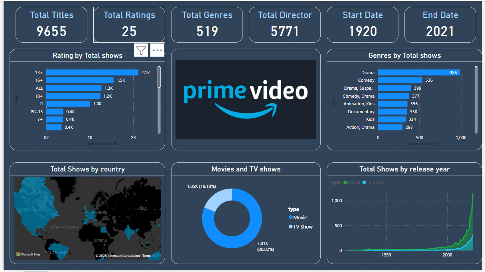

# Prime Video Analysis

A Power BI dashboard analyzing Amazon Prime Video content from 1920 to 2021. It covers total titles, ratings, genres, release trends, and country-wise distribution.

## Features

- 🎞️ Total Titles: 9,655
- 📅 Year Range: 1920–2021
- 📺 Content Types: TV Shows (80.82%), Movies (19.18%)
- 🌍 Country & Genre Insights
- 📊 Rating and Release Trends

## Tools Used

- Power BI
- DAX & Power Query
- Microsoft Bing Maps

## Author

**Drashti Sakhareliya**  
📧 drashtisakhareliya@gmail.com  
🔗 [LinkedIn](https://www.linkedin.com/in/drashti-sakhareliya-55b92b221/)
